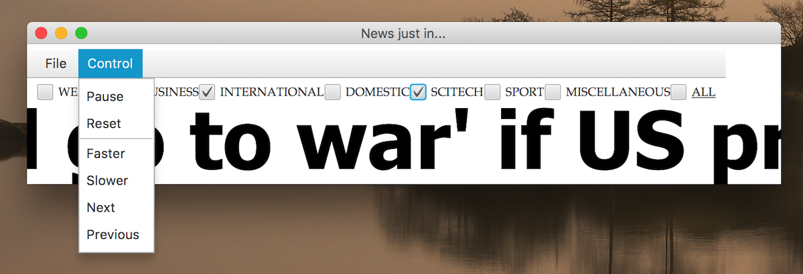

COMP6700/COMP2140 Assignment 2: Running Headline News
=====================================================

<span style="color:red**">*Due on 18.00 pm AEST Friday, May 26 2017*</span>

Academic Honesty and Integrity
------------------------------

Honesty and integrity are of utmost importance. 
These goals are not at odds with being resourceful and working collaboratively.
You *should* be resourceful and you should discuss the assignment and other 
aspects of the course with others taking the class.
However, *you must never misrepresent the work of others as your own*. 
If you have taken ideas from elsewhere or used code sourced from elsewhere, 
you must say so with utmost clarity.

Please read [the ANU's official position on academic honesty](http://www.anu.edu.au/students/program-administration/assessments-exams/academic-honesty-plagiarism).
If you have any questions, please ask the lecturers.

Preparation
-----------

Before you start working on Assignment Two, change (using the Terminal 
application on Mac/Linux, or Git-Bash on Windows) into the directory of
your local ``comp6700-2017`` (this applies to COMP2140 student as well) 
GitLab repository and execute the following commands:

```
git fetch git@gitlab.cecs.anu.edu.au:u1234567/comp6700-2017.git master
git checkout -b u1234567/comp6700-2017-master FETCH_HEAD
``` 

Review the changes if required; then merge the branch and fix any conflicts 
that come up:

```
git checkout master
git merge --no-ff u1234567/comp6700-2017-master
```


Proceed as usual to extend the Assignment Two code, commit changes and
push to the remote repository for submission (pushing is also recommended when
you commit changes in the local repository).

To start, use the `Makefile` inside the ``ass2`` directory, to compile and
run the original program:

```
make compile
make run
```

Import the source files into a new project which you create with an IDE, 
follow the default option during the set-up dialog. Compile and run the 
program from within the IDE as usual. Add any new Java source files you create,
and any other files that are required to run your project (e.g. `fxml`  and 
`css` files) to your repository.

The total size of additional code (excluding comments) should be around 350 LOC, 
depending on style of your code (high level or not) and choice 
of standard API. Use of good modularisation will be crucial for success.
The time necessary to study the necessary material (JavaFX API, relevant
techniques to use containers and streams) is around 15 hours.

Problem Description
-------------------

In this project, you will complete an application which simulates the running
of news messages on a display. A visually relevant example would be a news
headline display which can be seen in Canberra City at the crossing of
Northbourne Avenue and Alinga Street.  Another example is an extension
for the Safari browser, which displays running news in the top bar. We will
use a simple model in which a news item, described as a Json-string, is read
from a file, a fictitious timestamp is generated and included together with
the news item into a buffer of the class *Feeder*. The Feeder object represents
a news aggregator, and its buffer serves a supplier of news messages which
arrived at the time given by the timestamp. We possess all the messages and
the time of their "arrival" in advance, but pretend that messages arrive at
an asynchronous moments of time, and ordered in the message queue by the time
of their "arrival". (Think of this as if Dr. Who has gone into the future, 
collected all news messages, stored them in the order of their occurrence,
and brought this record back.) When you compile and run the original program,
it will display the following window with news items sliding one by one, from
right to left:


The original program does not have necessary features which are expected from
a program with graphical user interface (GUI). For starters, it takes the name
of the data file (which contains messages as json-strings) as a command-line
argument instead of providing a menu to open this file with a file chooser 
dialog. Also, the application provides only rudimentary control over the 
application behaviour: by using keys ``P`` and ``R`` (and also ``cmd-Q``), the
user can pause the running headlines, resume their motion, and quit the 
application. You will modify and extend the program to improve the user 
interface, and provide new features of control.

Tasks
-----

- Add a menu with following groups and items:
  - Open, Close, Quit (Close can be an optional feature, since other
    menu items will provide the relevant control)
  - Pause, Resume, Faster, Slower, Next, Previous

- Add a row of controls (most suitably implemented with ``javafx.scene.control.CheckBox`` class), each allowing to include news items which have a relevant topic. *Topic* is an inner enum class which defines the type of the *Message* class fields; another field, of the type *Status*, will be used to prioritise the news item order of display. Together --
  ``Topic``, ``Status`` and ``timestamp`` -- represent news message metadata.
  
- Implement priority ordering based on the `Message.Status` value and the timestamp
  of a message in the queue. A suitable container type for the Feeder's buffer
  is ``java.util.PriorityQueue``, which requires a comparator object (or a 
  functional interface), to determine in which order the elements are extracted
  from the container, and hence the order in which they will processed.
  Messages should be ordered according to their status, from EMERGENCY (highest
  priority) to SPECIAL_INTEREST (lowest priority).

- Add visual effects: 
  - colourise topics (mark each topic with a different colour)
  - add a separator between successive messages (in the running news display
    in Civic, they are separated by the ABC logo; you can use emoji symbols,
	for example, -- they are Unicode characters, and Java is Unicode friendly)
  - if the next message has a status of ``EMERGENCY``, make the currently 
    playing message fade away halfway through 
  - add styling to UI using css-styles

- If you wish, you may use FXML to define the user interface for your project,
  but this is not required. If you do use FXML 
  

Advice on how to approach the project
-------------------------------------

This short video provides an illustration of how your completed application
may look like:

[](http://cs.anu.edu.au/courses/comp6700/v_media/ass2.mp4)

The code which you will be writing can be placed in the existing classes, or
(at least some of the new code) in newly added classes. The design is not a key
consideration here, but it makes sense to pay attention to how newly emerging 
program will be organised. One special note -- the class *Controller* can be
either kept or removed; as of now, it does not play any role, it was 
auto-generated by the IDE as a part of the template JavaFX project. *Controller*
can be used if you pursue the creation of layout and control elements using the
FXML-based approach (we will discuss it briefly in the lectures), but all the
required tasks can be accomplished following the "old-fashioned" approach of 
creating appropriate statements inside the ordinary Java source files. If you
follow the latter, *Controller* can be removed altogether.

Marking guide
-------------

Marks will be awarded in accordance with the following scheme:

- Menu (File and Control) --- **4** points; ``File`` menu items should contain implemented callbacks for the message file opening operation, and for quitting
  the application; ``Control`` menu items ``Pause``, ``Resume`` and ``Reset`` should also be with implemented callbacks, while ``Faster``, ``Slower``,
  ``Next`` and ``Previous`` callback implementations will be the next task.

- Callback implementation for ``Faster``, ``Slower``,
  ``Next`` and ``Previous`` --- **4** points.

- Topic selection controls (as a row of check boxes, or in a different layout) --- **3** points; the selection controls should allow an arbitrary combination
  of topics (multiple checked boxes), and also contain an additional control
  (check box) to allow (de-)selection of all topics. The topic controls should
  be programmed, not hard-coded (that is, the program should itself determine
  the number and name of all controls from the *Topic* enum type).

- Visual Effects --- **2** points (implement two, either some of those which
  are mentioned above, or of your own device which can be fun)

- Priority queue implementation for the message buffer  --- **1** point

- The program *style* and quality of *comments* --- **1** point


Submission protocol
-------------------

Your submission must be pushed to your ``comp6700-2017`` GitLab repository.
The necessary instructions are provided in the 
[Forking your GitLab repository](https://cs.anu.edu.au/courses/comp6700/labs/gitlab/) --- a set of instructions
which is a part of Week Four exercises. All the source code for Assignment Two
must be inside the directory ``comp6700-2017/ass2`` (of your forked 
repository).
Your main class should be called ``RunningHeadline`` as per the distribution
in the repository - do not change the name or move it from the ``ass2/src``
directory.
The last commit prior to the submission deadline will be regarded as
your submission. 

We do not prescribe the use of any particular IDE or
other tools (*tools agnostic* specifications), but you are free to include a
project file which an IDE creates to configure your project.

**Do not zip your submission**; it should be committed to GitLab as individual
files.
In general, it is bad practice to commit compressed files (such as zipped 
archives) to a Git repository.
Please **do not commit Java byte code** i.e. the `.class` files.

